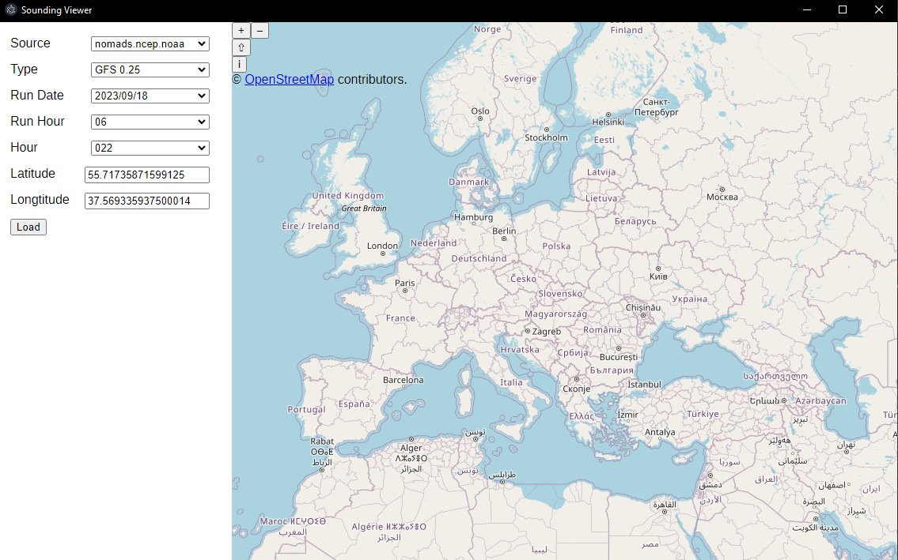
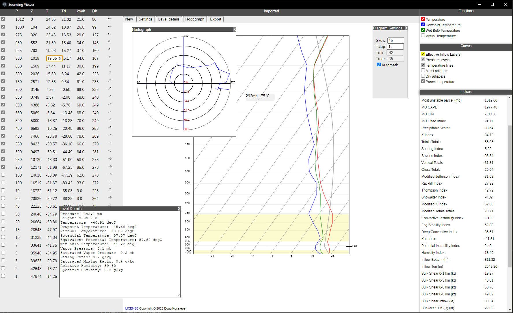

# Sounding Viewer

An open source sounding viewer and editor. The application provides a simple interface to download and plot GFS soundings from rucsoundings.noaa.gov and nomads.ncep.noaa.gov. Prints data as a table, draws Skew-T log-P diagrams, and shows computed instability indices.




## Features
+ All values in the sounding table are modifiable. Changes are immediately reflected in the diagram and in the indices panel.
+ It is possible to exclude any particular pressure level from the sounding. The lowest included level is used as the surface level for computing parcel temperatures and indices such as CAPE and Lifted Index.
+ Pressure levels in the table can be deleted, or new pressure levels can be created. When a new pressure level is added, its values are determined by linear interpolation or linear extrapolation, but these values can also be modified by the user.
+ Skewness and temperature limits of the Skew-T diagram can be set by the user.
+ The curves and functions to be drawn are determined using checkbox lists.

## Dependencies

No external dependencies are required for soundings obtained from rucsoundings.noaa.gov, but the data is relatively limited. In order to parse GRIB2 files obtained from nomads.ncep.noaa.gov, [wgrib2](https://www.cpc.ncep.noaa.gov/products/wesley/wgrib2/) is required.

**On Windows**

The wgrib2 binaries together with necessary Cygwin DLLs are provided at the wgrib2 website:
[https://ftp.cpc.ncep.noaa.gov/wd51we/wgrib2/Windows10/v3.0.2/][https://ftp.cpc.ncep.noaa.gov/wd51we/wgrib2/Windows10/v3.0.2/]

Download all files at the link into the same directory, and add that directory to the environment variable PATH before installing Sounding Viewer.

**On Linux**

Most common distributions have wgrib2 package in their repositories. If you use a distribution that does not provide wgrib2 binaries, it can be easily compiled from [source](https://www.ftp.cpc.ncep.noaa.gov/wd51we/wgrib2/) by simply running 'make'. No configuration is needed. The binary is produced in the subdirectory wgrib2. Adding that directory to PATH is sufficient.

## Installing

For Windows and Debian-based Linux distributions, binary installers can be found under releases.

**Compiling from source**

To build and start the application:
```console
npm install
npm run build
npm run start
```

To create a binary installer:
```console
npm install
npm run build
npm run make
```
